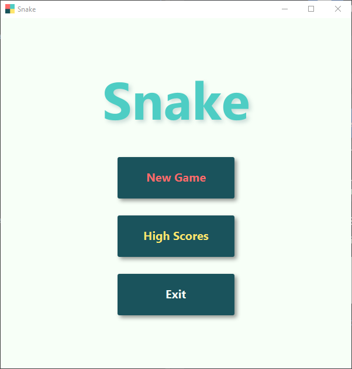
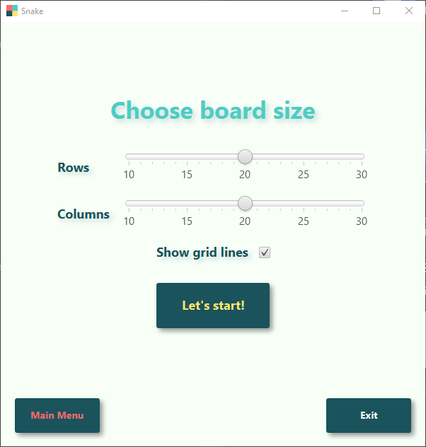
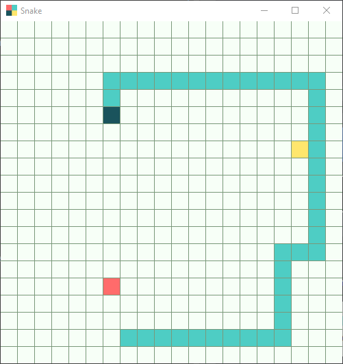
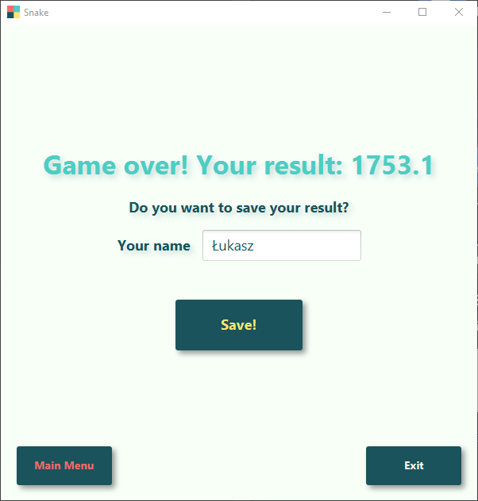
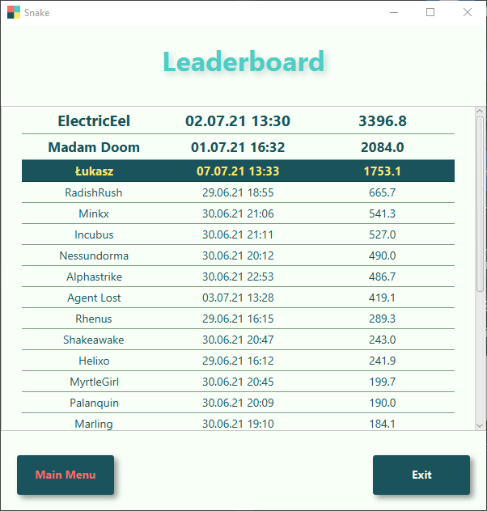

## Project Snake (JavaFX)

My implementation of the popular game "Snake", where the player controls a growing line of squares (aka "snake"). Main 
goal of the game is to collect points and avoid hitting yourself, or the walls of board. The game rewards those players
who play on smaller boards (because they must be more careful), see the scoring formula below.

The game was created as a final student project at the end of semester II. The project's functional requirements are 
described in `PROJECT_REQUIREMENTS.png` file.

### Setup
_Make sure you have Java 11 installed on your computer_

1. download `shade` folder
2. double-click on `Snake.jar` (the game can be also run from a terminal: `java -jar Snake.jar`)

* You can also download source files and compile them by yourself (use Maven to download dependencies).

### How to play
#### Controls
* `🠈` `🠊` `🠉` `🠋` - changes movement direction of the snake
* `space` - pauses/unpauses the game
* `Ctrl` + `Q` - ends the current game and goes back to the main menu
#### Food
* red - worth 1 point, increase length of the snake by 1 unit
* yellow - worth 1 point, decrease length of the snake by 1 unit (yellow food spawns rarely)
#### Scoring
* player's final score is calculated based on the following formula:
    
  
    
  where `boardSize` is the number of board cells, and `time` is measured by game loops (1 loop per ~150 ms)

### Screenshots

  
_Made by Łukasz Bieńkowski_
